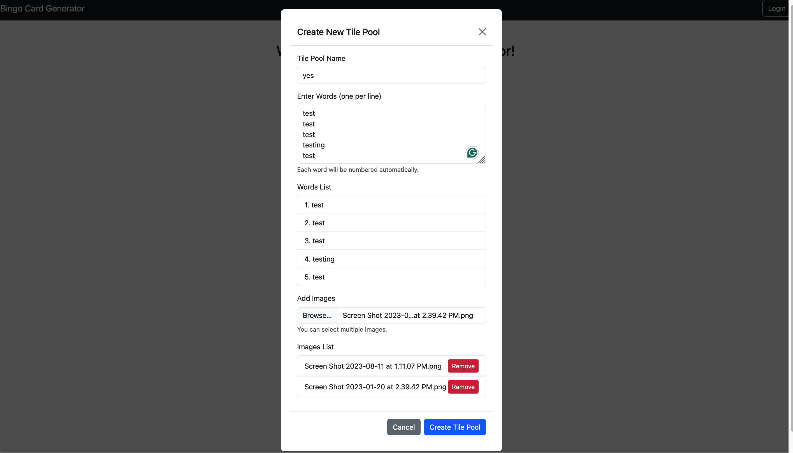

# BingoMaker

<!-- TODO: BingoMaker Branding -->

::: notes
Yousuf

* project description
:::

## Features

* Play bingo
* Create bingo tile pools
* Save bingo cards
* Print bingo cards
* Edit bingo cards
* Share bingo cards

::: notes
Anyone

:::

# System Architecture

::: notes
Yousuf
:::

# Demo

**QRCODE**

::: notes
Derek

:::

# Technologies Not Covered in Class

## UV

::: notes
JP

* pip replacement and project manager
* supports the dependency grouping
    * use to install only what is required for lambdas
    * (segue into lambda layers)
:::

## Localstack

::: notes
JP

* locally run some aws service
* does not support all aws services
    * some require a premium subscriptions
    * (segue into lambda layers)
:::

## Lambda Layers

::: notes
JP

* reuse shared dependencies across lambdas
* supports versioning
:::

## Terraform

::: notes
Owen

<!-- JP: this slide should be fairly light, it should be what is terraform not how we use it -->
<!-- JP: the how we use terraform comes in the next section -->

* cloud orchestration, similar to cloudformation
* allows us to almost have single `up`/`down` commands
    * amplify issue
<!-- JP: might want to place amplify issue in the automation section -->

:::

# Automation/Scripting

<!-- JP: Idk where but we should mention how all our commands are tucked away in a makefile -->

## Scripted Lambda Layers

::: notes
JP

* makefile stuff
:::

## Automation Terraform

::: notes
Owen

* need to set env vars
* makes dep tree so services are started in corrected order
:::

# Lessons Learned

::: incremental

* collaboration
* read documentation
* no, don't have ChatGPT read it **READ THE DOCS**

:::

::: notes
Everyone
<!-- JP: I think it's best if we all list at least one take away -->

* Group: integrate changes fast and often
* JP: **READ THE OFFICIAL DOCS, NOT STACK OVERFLOW**
    * localstack issue
    * boto3 client issue
:::

# Future Work

::: notes
Derek/?Yousuf

* cognito?
* images?
:::
